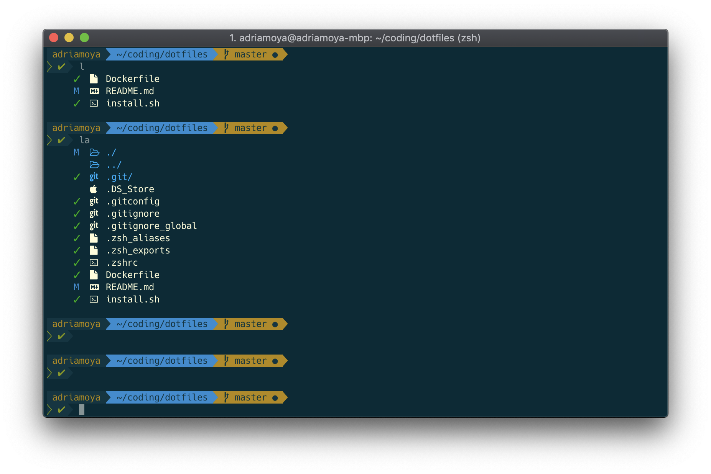

# Dotfiles


<p style="text-align:center; margin-top:-50px; font-style: italic;">
  <small>iTerm2 + Zsh + Powerlevel9k + Hack Nerd + Colorls</small>
</p>

## Prerequisites

__iTerm2 + Homebrew__

* If you haven’t already, install the mac package manager [Homebrew](https://docs.brew.sh/Installation.html).
* Install the terminal [iTerm2](https://www.iterm2.com/downloads.html) or through homebrew using `brew cask install iterm2`

## What's included

Customizing iTerm2 terminal for the shell Zsh.

* Installation of [Zsh](http://www.zsh.org/) shell and [oh-my-zsh](https://github.com/robbyrussell/oh-my-zsh).
 - Themes:
   - [powerlevel9k](https://github.com/bhilburn/powerlevel9k)
   - [spaceship-prompt](https://github.com/denysdovhan/spaceship-prompt)
 - [Color schemes](https://github.com/mbadolato/iTerm2-Color-Schemes):
   - Solarized Dark
   - MaterialDark
 - Fonts:
   - Hack Nerd
   - Powerline
* Ruby gems:
 - [colorls](https://github.com/athityakumar/colorls)
* Git config files

## Installation

```shell
. ./install.sh
```

## Testing

```shell
# Added Dockerfile for easier testing of install script.
docker build -t dotfiles_test .
docker run -it --rm --name dotfiles_test dotfiles_test
```

## Next

* Framework (Python, ...)
* Atom packages + customization
* OSX apps

## Bibliography

https://medium.com/@oldwestaction/beautifying-your-terminal-with-zsh-prezto-powerlevel9k-9e8de2023046

https://medium.freecodecamp.org/how-you-can-style-your-terminal-like-medium-freecodecamp-or-any-way-you-want-f499234d48bc

https://medium.freecodecamp.org/lolcat-colorls-catpix-and-other-ruby-gems-to-add-color-to-your-terminal-16f4d9499ac7
